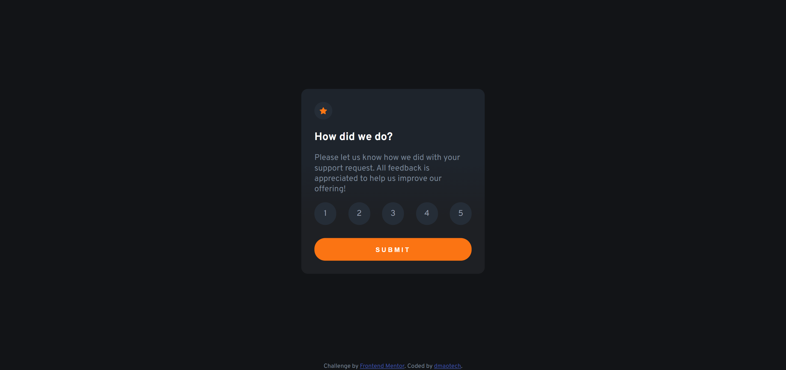
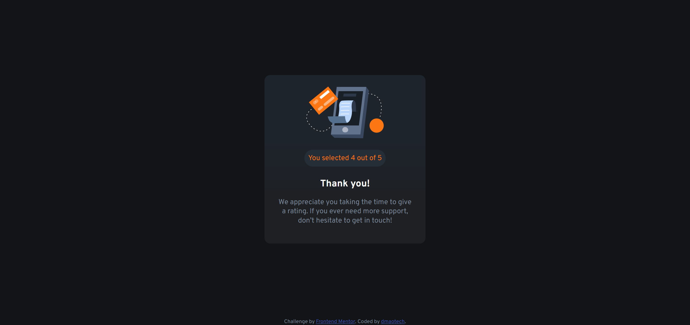

# Frontend Mentor - Interactive rating component solution

This is a solution to the [Interactive rating component challenge on Frontend Mentor](https://www.frontendmentor.io/challenges/interactive-rating-component-koxpeBUmI). 

## Table of contents

- [Overview](#overview)
  - [The challenge](#the-challenge)
  - [Screenshot](#screenshot)
  - [Links](#links)
- [Details](#my-process)
  - [Built with](#built-with)
- [Author](#author)

## Overview

### The challenge

Users should be able to:

- View the optimal layout for the app depending on their device's screen size
- See hover states for all interactive elements on the page
- Select and submit a number rating
- See the "Thank you" card state after submitting a rating

### Screenshots

### Links

- Solution URL: [https://dmaotech-interactive-rating-component.netlify.app/](https://dmaotech-interactive-rating-component.netlify.app/)
- Live Site URL: [Soon]()

## Details
> - Added a error message when you try to submit a undefined value (no options selected).

> - I had to choose my own colors for making it look like the design because the ones given by Frontend Mentor doesnt fit.

### Built with

- Semantic HTML5 markup
- CSS custom properties
- Flexbox
- Mobile-first workflow
- JavaScript

## Author

- Website - [Soon]())
- Frontend Mentor - [@dmaotech](https://www.frontendmentor.io/profile/dmaotech)
- Twitter - [Soon]()
